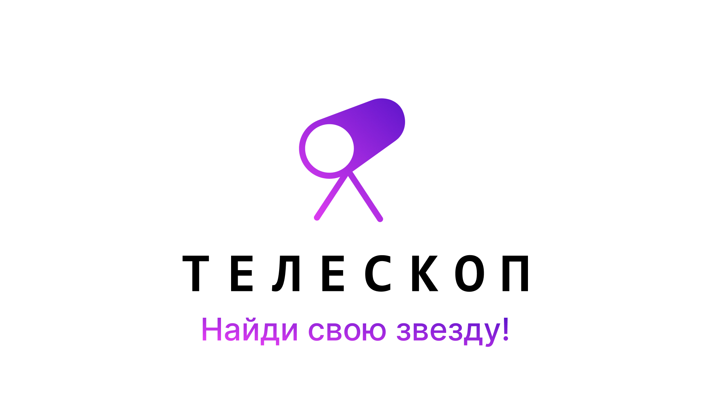
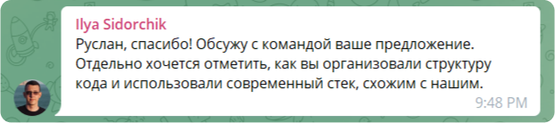

# :telescope: Телескоп

 

 

 
*Внимание! Форма добавления поисковика адаптирована.*

## **Описание**
#### Что делает приложение?
Телескоп — это React-компонент для ваших проектов. Особенностью поиска является поиск по ссылкам, группам, карточкам. А так же я добавил калькулятор для несложных выражений. 

#### Какие технологии я использовал?
Я использовал React, потому что он прост в использовании. Помимо React, я начал использоваnm библиотеку Redux, которая позволила мне создавать кнопки и сохранять их в памяти (до перезагрузки страницы).

#### СДАМ.ГИА
Я благодарен за участие в разрботке СДАМ.ГИА (сайт по подготовке к экзаменам), так как оно открыло мне много нового по React. Особенно хотел бы поблагодарить Илью Сидорчика, главного разработчика Front-end части. Написав проект, я отправил предложение на внедрение Телескопа на сайт СДАМ.ГИА. И вскоре я получил ответ от Ильи Сидорчика: «Руслан, спасибо! Обсужу с командой ваше предложение. Отдельно хочется отметить, как вы организовали структуру кода и использовали современный стек, схожим с нашим.»

## Оглавление
- Описание
- Что делает приложение?
- Какие технологии я использовал?
- СДАМ.ГИА
- Установка
- Использование проекта
- Как пользоваться проектом?
- Вклад
- Как вы можете внести свой вклад в проект?
- Существуют ли какие-либо требования к участникам?
- Каковы правила внесения вклада?
- Особенности проекта
- Какова цель веб-приложения?
- Можно ли жульничать?
- Список дел
- Лицензия на авторское право

## **Установка**
Исходный код: позволяет вам увидеть весь код.
*Планируется установка с помощью npm* 
 
## **Использование проекта**
#### Как использовать проект?
*Скоро допишу* 

## **Вклад**
#### Как вы можете внести свой вклад в проект?
Просто напишите мне по электронной почте или телеграм. Я загляну на страницу вашего профиля и отправлю вам ссылку с приглашением. 
#### Существуют ли какие-либо требования к участникам?
Просто вежливо напишите мне, и я с радостью приму вашу помощь. Я полон решимости сделать этот код как можно лучше.
#### Каковы правила внесения вклада?
Просто не связывайся с файлами. Помните, что вы можете быть привлечены к ответственности за саботаж любого рода.

## Особенности проекта
#### Какова цель веб-приложения?
Главное ускорить работу, на видео-превью выше вы видели поиск оптимизированный для сайта СДАМ.ГИА

#### Можно ли жульничать?
Конечно, вы можете редактировать код после того, как скачали, и я не могу помешать вам удалить её. Главное соблюдайте правила лицензии проекта. Если вы столкнулись с ошибкой либо в веб-приложении либо в браузере, пожалуйста, откройте проблему, и я постараюсь её исправить.

## Список дел
- [x] Тщательное тестирование кода. 
- [x] Реорганизуйте код. 
- [x] Сделайте опыт лучше. 
- [x] Улучшить внешний вид. 
- [ ] Написать документацию. 
- [ ] Выпустить npm пакет Телескопа. 

## Лицензия на авторское право
Я открыт для людей, копирующих мой код и улучшающих его. Однако, пожалуйста, не берите просто мой код и не утверждайте, что он ваш. 

  

Я с нетерпением жду возможности улучшить работу Телескопа. Поэтому, пожалуйста, не стесняйтесь открывать вопросы или связываться со мной: *akseonowww@ya.ru*, @akseonowww (Telegram, VK).