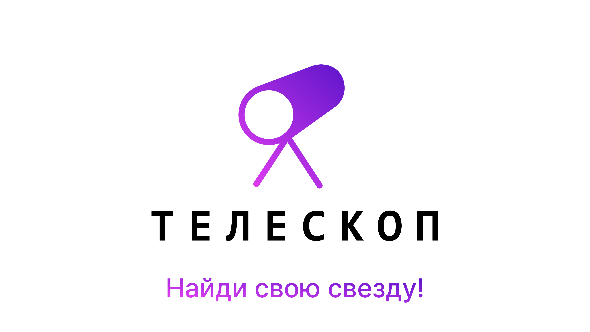

# :telescope: Телескоп

 

 

 

## **Описание**
#### Что делает приложение?
Телескоп - это React-компонент для ваших проектов. Особенностью поиска являеться поиск по ссылка, группам, карточкам. Так же я добавил калькулятор для несложных выражений. 

#### Какие технологии я использовал?
Я использовал React, потому что он прост в использовании. Я также использовал VS Code. Это потому, что он дружелюбен к новичкам (таким как я)! Помимо React, я начал использовал библиотеку под названием Redux, который позволил мне создавать кнопки и сохранять в памяти (до перезагрузки страницы).

## Оглавление
- Описание
- Что делает приложение?
- Какие технологии я использовал?
- Установка
- Использование проекта
- Как пользоваться проектом?
- Вклад
- Как вы можете внести свой вклад в проект?
- Существуют ли какие-либо требования к участникам?
- Каковы правила внесения вклада?
- Особенности проекта
- Какова цель веб-приложения?
- Ты умеешь жульничать?
- Список дел
- Лицензия на авторское право

## **Установка**
Исходный код: Это позволяет вам увидеть весь код.
 
## **Использование проекта**
#### Как использовать проект?
Опять же, это зависит от обстоятельств. 
 Если вы выбрали первый вариант (необработанный код) из приведенного выше, вам понадобится интерпретатор python, затем просто нажмите "Выполнить". 
 Если вы выбрали второй вариант (который, на мой взгляд, самый простой, если у вас есть как Python, так и PyGame), просто нажмите на приложение, и игра запустится сама по себе. 
 Если вы выбрали последнее, нажмите на приложение, разрешите ему вносить изменения и все такое прочее, а затем следуйте инструкциям. Весь процесс установки займет у вас не более 20 секунд.

## **Вклад**
#### Как вы можете внести свой вклад в проект?
Простой. Просто напишите мне по электронной почте, телеграм. Я загляну на страницу вашего профиля и отправлю вам ссылку с приглашением. 
#### Существуют ли какие-либо требования к участникам?
Нет, конечно, нет! Кем бы я был, чтобы судить, должны ли вы иметь возможность внести свой вклад в проект. Просто вежливо напишите мне, и я с радостью приму вашу помощь. Я полон решимости сделать всех равными, чтобы сделать этот код как можно лучше.
#### Каковы правила внесения вклада?
Просто не связывайся с файлами. Помните, что вы можете быть привлечены к ответственности за саботаж любого рода.

## Особенности проекта
#### Какова цель веб-приложения?
Главное ускорить работу, на видео-превью выше вы видели поиск оптимизированный для сайта СДАМ.ГИА

#### Можешь ли ты жульничать?
Конечно, вы можете редактировать код после того, как скачали другую копию, и я не могу помешать вам удалить меры. Если вы столкнулись с ошибкой либо в веб-приложении либо в браузере, пожалуйста, откройте проблему, и я постараюсь ее исправить.

## Список дел
- [x] Тщательное тестирование кода. 
- [x] Реорганизуйте код. 
- [x] Сделайте опыт лучше. 
- [x] Улучшить внешний вид. 

## Лицензия на авторское право
Я открыт для людей, копирующих мой код и улучшающих его. Просто свяжите меня с проектом. 

Однако, пожалуйста, не берите просто мой код и не утверждайте, что он ваш. 

  

Я с нетерпением жду возможности улучшить работу этого кода. Поэтому, пожалуйста, не стесняйтесь открывать вопросы или связываться со мной: *akseonowww@ya.ru*, @akseonowww (Telegram, VK).